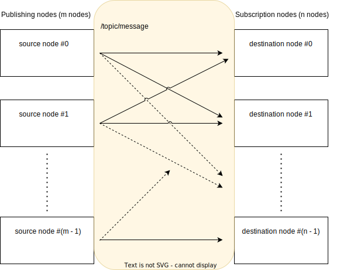

# Premise of communication

## 1-to-1 communication

<prettier-ignore-start>
!!!info
    This premise section may be boring for some users. If you don't have much time, please feel free to skip the section.
<prettier-ignore-end>

In ROS 2, nodes communicate each other via topic messages. The topic messages are transmitted by publisher and received by subscription. The following figure shows the simplest example where one node sends topic message and the other node receives it.

CARET serves `Communication` class which focus on a topic message from a source node to a destination node. A `Communication`-based object is retrieved from method, `Application.get_communication('source node', 'destination node', '/topic/message')`. A `Communication` object has a collection of timestamps which are obtained when both publish and subscription on a target message are performed successfully. `Communication` class is explained in the page.

Topic messages have possibility to be lost in communication path as they are transmitted and received by UDP. A `Communication` object ignores loss of topic messages. If you want to check loss of topic messages, it is reasonable to compare the number of publish and that of subscription. CARET serves both `Publish` and `Subscription` class. A `Publish` object has a collection of timestamp obtained when publish is invoked. A `Subscription` object have timestamps of invocation of subscription callback.

## Many-to-many communication

ROS 2 allows topic messages to be published from multiple nodes and to be received by multiple nodes. Topic messages who share a same topic messages are transmitted and received among many nodes as the following figure shows.

If you want to investigate performance of many-to-many communication, CARET requires you to divide them into 1-to-1 communication and select a set of 1-to-1 communications. You will execute `Application.get_communication()` per target communication.

### Caution for Many-to-1 communication

CARET requires users to take care of Many-to-1 communication. Many-to-1 communication means that topic messages are published from multiple nodes and received by a single node as the following figure shows.

In this case, invocation frequency of publish on the source node is different from that of subscription on the destination node. The destination node receives topic messages from 2 other nodes. It is expected that sum of publish frequency on three nodes is equaled to that of subscription.

If you see that publish frequency is different from subscription frequency, you may think loss of topic messages. However, it is reasonable when many-to-1 communication is performed.
